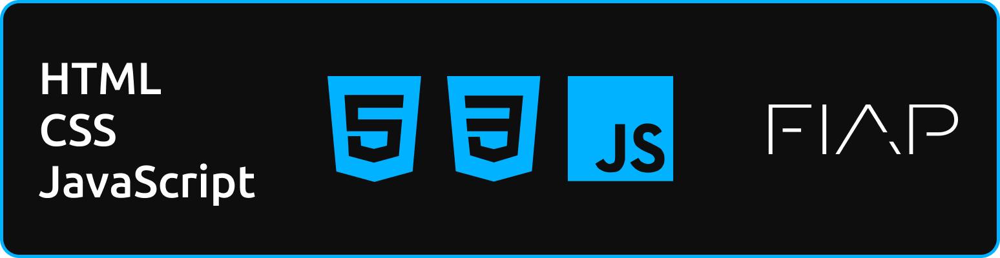

# CRIADOR
- **[Kaique Rodrigues Zaffarani](https://github.com/Z4ffarani)**

<br>

# INTRODUÇÃO
O Design de Front-end é uma área crucial no desenvolvimento web, responsável por criar interfaces intuitivas e visualmente atraentes que proporcionam uma excelente experiência ao usuário. Ele combina habilidades de design e programação para transformar conceitos visuais em páginas web interativas e responsivas.

Utilizando tecnologias como **[HTML](https://developer.mozilla.org/pt-BR/docs/Web/HTML)**, **[CSS](https://developer.mozilla.org/pt-BR/docs/Web/CSS)** e **[JavaScript](https://developer.mozilla.org/pt-BR/docs/Web/JavaScript)**, os desenvolvedores de Front-end criam a estrutura e o estilo dos sites, garantindo que eles sejam acessíveis, responsivos e funcionais. O Front-end Design é uma disciplina multifacetada que requer criatividade, conhecimento técnico e uma compreensão profunda da experiência do usuário.

<br>

# FUNDAMENTOS
- **HTML (HyperText Markup Language)** | A estrutura básica de qualquer página web, define o conteúdo e a organização das informações. Com o HTML, é possível criar e organizar textos, imagens, links, tabelas e outros elementos que compõem a interface de um site.

- **CSS (Cascading Style Sheets)** | Responsável pela estilização e aparência dos elementos HTML. Com CSS, é possível controlar a cor, o layout, o espaçamento e outros aspectos visuais, proporcionando uma experiência de usuário agradável e personalizada.

- **JavaScript** | Linguagem de programação que permite adicionar interatividade às páginas web. Com JavaScript, é possível criar animações, validar formulários, manipular o DOM (Document Object Model) e implementar lógica de negócio no Front-end, tornando as interfaces mais dinâmicas e responsivas.

- **Design Responsivo** | Técnica que adapta o layout de um site para diferentes tamanhos de tela e dispositivos. Utilizando media queries e frameworks como **[Bootstrap](https://getbootstrap.com)**, o design responsivo garante que o site seja acessível e funcional em smartphones, tablets e desktops.

<br>

# DESENVOLVIMENTO
- **Criação de Layouts Estruturados** | Utilizando HTML e CSS, é possível criar layouts organizados e consistentes, que seguem boas práticas de design e usabilidade. Estruturas de grid e flexbox ajudam a posicionar os elementos de maneira responsiva e flexível.

- **Interatividade e Animações** | Com JavaScript e bibliotecas como **[jQuery](https://jquery.com)** e **[GSAP](https://greensock.com/gsap/)**, é possível adicionar interatividade e animações fluídas, tornando a navegação mais intuitiva e envolvente para o usuário.

- **Gerenciamento de Estado** | Em projetos Front-end complexos, o gerenciamento de estado é essencial para sincronizar dados entre diferentes partes da aplicação. Bibliotecas como **[Redux](https://redux.js.org)** facilitam esse processo, garantindo que o estado da aplicação seja consistente e previsível.

- **Integração com APIs** | As interfaces modernas muitas vezes se comunicam com APIs para buscar e enviar dados. Utilizando JavaScript e bibliotecas como **[Axios](https://axios-http.com)** ou o próprio **fetch API**, é possível integrar a aplicação com serviços externos, enriquecendo a experiência do usuário.

- **Desenvolvimento de Componentes Reutilizáveis** | Com frameworks como **[React.js](https://react.dev)**, **[Vue.js](https://vuejs.org)** e **[Angular.js](https://angular.io)**, é possível criar componentes reutilizáveis que encapsulam lógica e estilo, facilitando a manutenção e escalabilidade do projeto.

<br>

# VANTAGENS
- **Experiência de Usuário** | Um bom design de Front-end proporciona uma navegação intuitiva e agradável, facilitando a interação dos usuários com a aplicação.

- **Desenvolvimento Ágil** | Ferramentas como preprocessadores de CSS (Sass, Less) e frameworks front-end aceleram o desenvolvimento e melhoram a organização do código.

- **Escalabilidade e Manutenção** | Componentes reutilizáveis e um código bem estruturado facilitam a escalabilidade e a manutenção de grandes projetos front-end.

- **Acessibilidade** | Aplicar boas práticas de acessibilidade garante que o site seja utilizável por pessoas com diferentes habilidades, ampliando o alcance da aplicação.

<br>

# CONCLUSÃO
O desenvolvimento de Front-end Design é uma combinação de arte e ciência, que visa criar interfaces intuitivas, responsivas e esteticamente agradáveis. Com uma base sólida em HTML, CSS e JavaScript, e utilizando frameworks e bibliotecas modernas, os desenvolvedores podem criar experiências ricas e envolventes para os usuários. Um bom Front-end Design não só melhora a usabilidade, mas também contribui para a imagem e o sucesso de uma aplicação ou site.

<br>

# OBSERVAÇÕES
- Este projeto é uma coletânea de anotações e exemplos práticos desenvolvidos durante o estudo de Front-end Design. Inclui conceitos básicos e avançados, exemplos de código, boas práticas e exercícios resolvidos. O objetivo é organizar e consolidar o conhecimento adquirido, servindo como exemplo para desenvolvedores que desejam aprofundar suas habilidades em Front-end.

<br>

# INSTRUÇÕES
1. Em um terminal, clonar o repositório:
```bash
git clone https://github.com/Z4FFARANI-STUDY/FRONT-END-DESIGN.git
```

2. No terminal, navegar até a pasta do projeto:
```bash
cd FRONT-END-DESIGN
```

3. Acessar o conteúdo das aulas adiante da pasta `SEM1` ou `SEM2`.
